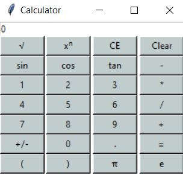

# Python-Calculator-using-Tkinter
## General info
This project is a simple calculator having the standard operations (add, substract, divide, multiply, exponential, square root and negate) and some scientific ones (pi and e values, sinus, cosinus and tangent).
This calculator allows the user to continuosly input values and symbols in the equation until the equal button is pressed. 
When using square root, sinus, cosinus and tangent, always use parentheses.

## Interface

## Technologies
* Python 3.8
* Tkinter
* Math
